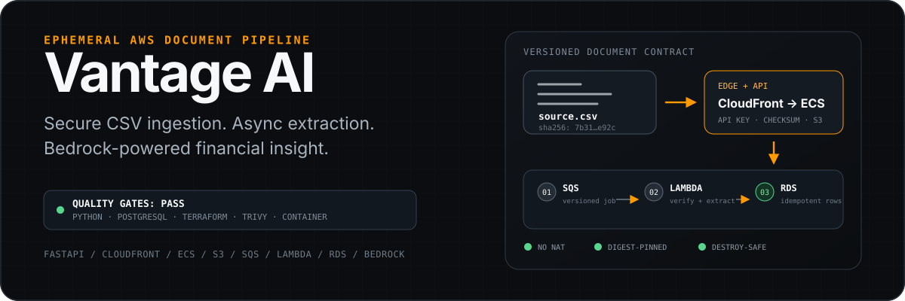
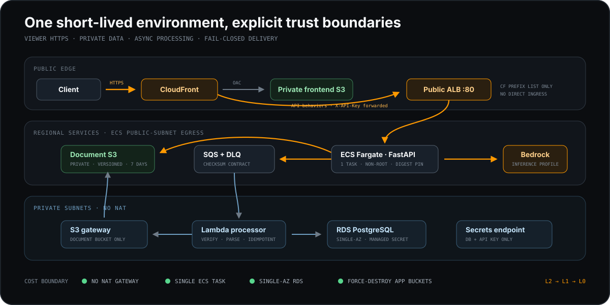

<p align="center">
  
</p>

<p align="center">
  <strong>Upload financial CSVs, process them asynchronously, and turn verified records into Amazon Bedrock insights.</strong>
</p>

<p align="center">
  <a href="#see-it-work-locally">Run locally</a> ·
  <a href="#system-design">Architecture</a> ·
  <a href="#engineering-decisions">Engineering decisions</a> ·
  <a href="#deploy-to-aws">AWS deployment</a>
</p>

## Quality baseline

Vantage AI is a production-oriented document intelligence platform built around
an asynchronous AWS workload, with explicit controls for security, deployment,
observability, and recovery.

| Quality signal | Engineering evidence |
|---|---|
| Application behavior | 108 collected tests across API, migrations, storage, security, queue contracts, Lambda, and deployment safeguards |
| Test depth | 87.37% branch-aware Python coverage; minimum gate remains 70% |
| Database evolution | Full Alembic history tested against PostgreSQL 16 in CI |
| Infrastructure | Bootstrap plus L0/L1/L2 Terraform roots initialize without backend credentials and validate successfully |
| Security scanning | `pip-audit` clean; Trivy blocks fixable HIGH/CRITICAL image findings and all HIGH/CRITICAL IaC findings |
| Artifact integrity | API image is Git-archive-built and digest-pinned; Lambda ZIP and every saved Terraform plan are checksum-bound |

These results are reproducible with `make check` and `make tf-check`. CI also builds the Linux Lambda package and scans the final container image without receiving AWS credentials.

## Engineering highlights

- **A real asynchronous document contract:** S3 object key, schema version, trace ID, and SHA-256 checksum move through SQS to Lambda.
- **Fail-closed cloud operations:** the AWS account and all three Terraform workspaces are verified before plan, apply, ECR access, or destroy.
- **Runtime secret handling:** RDS owns the master password in Secrets Manager; ECS and Lambda receive an ARN, not a database URL containing credentials.
- **Cost-aware architecture:** no NAT Gateway, one ECS task, Single-AZ RDS, short retention, and destroy-safe application buckets.
- **Auditable delivery:** immutable ECR tags, `repository@sha256:...` task definitions, Git commit provenance, saved-plan manifests, and non-root containers.

## System design

<p align="center">
  
</p>

CloudFront is the public entry point. It serves a private frontend bucket through Origin Access Control and forwards API routes to an ALB that only accepts the AWS-managed CloudFront origin-facing prefix list. ECS has outbound internet routing but no direct inbound rule.

Lambda and RDS remain in private subnets. Lambda reaches only the document bucket through an S3 gateway endpoint, the managed database secret through a scoped Secrets Manager interface endpoint, and PostgreSQL through an explicit security-group relationship.

### Document lifecycle

1. **Validate** — FastAPI accepts a UTF-8 CSV up to 1 MiB and checks the required financial columns.
2. **Store** — the API writes the original document to private, encrypted, versioned S3 with checksum metadata.
3. **Queue** — SQS carries the document reference, checksum, schema version, document ID, and trace ID.
4. **Process** — Lambda verifies the checksum, parses the CSV, and idempotently replaces that document's records in PostgreSQL.
5. **Analyze** — authenticated API routes send the normalized records to a configured Bedrock inference profile for summaries and anomaly detection.

## See it work locally

### Requirements

- Docker with Compose
- `curl`
- Optional: local AWS credentials for Bedrock insight calls

```bash
# Start FastAPI and PostgreSQL 16
make dev

export API_KEY=local-development-only

# Public liveness
curl http://localhost:8000/health

# Upload the included ten-row sample
DOC_ID=$(curl -s -X POST http://localhost:8000/documents/upload \
  -H "X-API-Key: $API_KEY" \
  -F "file=@sample-data.csv" \
  | python3 -c 'import json,sys; print(json.load(sys.stdin)["document_id"])')

# Local mode processes inline, so records are immediately queryable
curl -H "X-API-Key: $API_KEY" \
  "http://localhost:8000/records?document_id=$DOC_ID"

make down
```

Local mode deliberately replaces S3/SQS/Lambda with in-memory storage and inline processing so the core flow is testable without AWS charges. Bedrock calls still require valid local AWS credentials. The Compose container runs as UID/GID `10001` and reads an explicitly mounted, read-only profile from `/home/vantage/.aws`.

<details>
<summary><strong>API surface</strong></summary>

| Method | Path | Purpose | Auth |
|---|---|---|---|
| `GET` | `/health` | Process liveness | Public |
| `GET` | `/ready` | Database readiness | Public |
| `POST` | `/documents/upload` | Validate and store a CSV | API key |
| `GET` | `/documents/{id}/status` | Poll document processing | API key |
| `GET` | `/records` | Filter records by document or category | API key |
| `GET` | `/records/{id}` | Retrieve one record | API key |
| `POST` | `/insights/analyze` | Totals, summary, categories, anomalies | API key |
| `GET` | `/insights/summary` | Plain-language summary | API key |
| `GET` | `/insights/anomalies` | AI-flagged anomalies | API key |
| `GET` | `/docs` | OpenAPI UI | Local/documented access |

All protected routes use `X-API-Key`. The comparison is timing-safe, and the key is excluded from structured request logs.

</details>

## Engineering decisions

| Constraint | Decision | Why it matters |
|---|---|---|
| The deployment path should be easy to understand and audit | A single `portfolio` environment with an allowlisted account and isolated state | Reduces operational complexity and keeps the infrastructure readable |
| NAT Gateway idle cost is disproportionate for an ephemeral environment | ECS uses a public subnet for outbound calls; Lambda uses private endpoints | Keeps environment cost proportional to intermittent use |
| CloudFront's default domain has no matching ALB certificate | Viewer HTTPS, CloudFront allowlist, HTTP origin hop | Documents the limitation; production should use custom DNS and end-to-end TLS |
| Database passwords must not live in tfvars or task definitions | RDS-managed Secrets Manager password resolved at runtime | Removes plaintext database URLs from infrastructure configuration |
| Mutable image tags weaken traceability | Immutable Git-SHA tag plus ECR digest in ECS | A reviewed commit maps to one deployed image |
| A plan can drift or be replaced between review and apply | One saved plan per layer with SHA-256 manifests | A modified plan is rejected before Terraform runs |
| Ephemeral data and infrastructure need a bounded lifecycle | Seven-day document lifecycle and L2 → L1 → L0 destroy order | Limits storage retention and makes cleanup explicit |

## Delivery and quality gates

Pull requests and pushes to `main` or `feature/**` run a credential-free pipeline:

```text
workflow policy
    ├── Python 3.12 + PostgreSQL 16 → Ruff → pytest/coverage → pip-audit
    ├── Lambda package             → Linux AMD64 ZIP → import/compile check
    ├── Terraform                  → fmt → backend-free init/validate → Trivy
    └── API container              → local build → Trivy image scan
```

CI has `contents: read` only. It does not request OIDC, read repository secrets, push an image, call AWS APIs, or apply Terraform. Trivy is SHA-pinned; remaining action SHAs are a documented final-release hardening item and are tracked by Dependabot.

Useful local gates:

```bash
make check       # lint, tests, coverage, Python dependency audit
make tf-check    # fmt + backend-free init/validate for all Terraform roots
docker compose config --quiet
```

## Deploy to AWS

The supported cloud workflow is intentionally manual:

```text
bootstrap once
  → select portfolio workspaces
  → plan/apply L0
  → plan/apply L1
  → build immutable artifacts
  → plan/apply L2
  → verify API and document flow
  → capture sanitized evidence
  → destroy L2 → L1 → L0
  → assert cleanup
```

Before any deployment transaction:

1. Use a dedicated, isolated AWS account.
2. Configure a small AWS Budget alert; it is an alert, not a hard cap.
3. Populate ignored backend/tfvars files from [the portfolio environment examples](terraform/environments/portfolio/README.md).
4. Store the approved 12-digit account ID only in ignored `.aws-account-id`.
5. Run `make tf-init && make tf-workspace`, then review and apply one saved plan at a time.

The full operator sequence is documented in [terraform/README.md](terraform/README.md). Plans and provenance metadata live under ignored `.tfplans/` because they can contain sensitive material.

```bash
# Syntax and provider validation: no AWS credentials or backend required
make tf-check

# Emergency cleanup is independent of Docker and ECR availability
make tf-destroy
```

## Repository map

```text
app/                         FastAPI API, runtime security, storage and Bedrock adapters
alembic/                     Versioned PostgreSQL schema and migration adoption
lambda/processor/            SQS-triggered checksum-verifying CSV processor
scripts/deploy/              Provenance, immutable image, saved-plan, and workflow guards
terraform/bootstrap/         State bucket and repository-scoped GitHub OIDC bootstrap
terraform/layers/            L0 foundation → L1 platform → L2 application
terraform/environments/      Safe examples; populated portfolio values stay ignored
tests/                       Unit and integration evidence
.github/workflows/ci.yml     Credential-free quality gates
```

## Known tradeoffs

- CloudFront-to-ALB traffic uses HTTP inside an AWS-managed origin allowlist; a production system should use a custom domain and ALB TLS.
- RDS is Single-AZ, WAF is omitted, and S3 uses SSE-S3 to keep the ephemeral, non-regulated environment cost-efficient.
- The frontend bucket contains a minimal placeholder page; the product UI remains a separate presentation layer.
- The bootstrap state bucket and OIDC identity intentionally survive routine application teardown; all other chargeable project resources must be removed.

## Further reading

- [Terraform operating guide](terraform/README.md)
